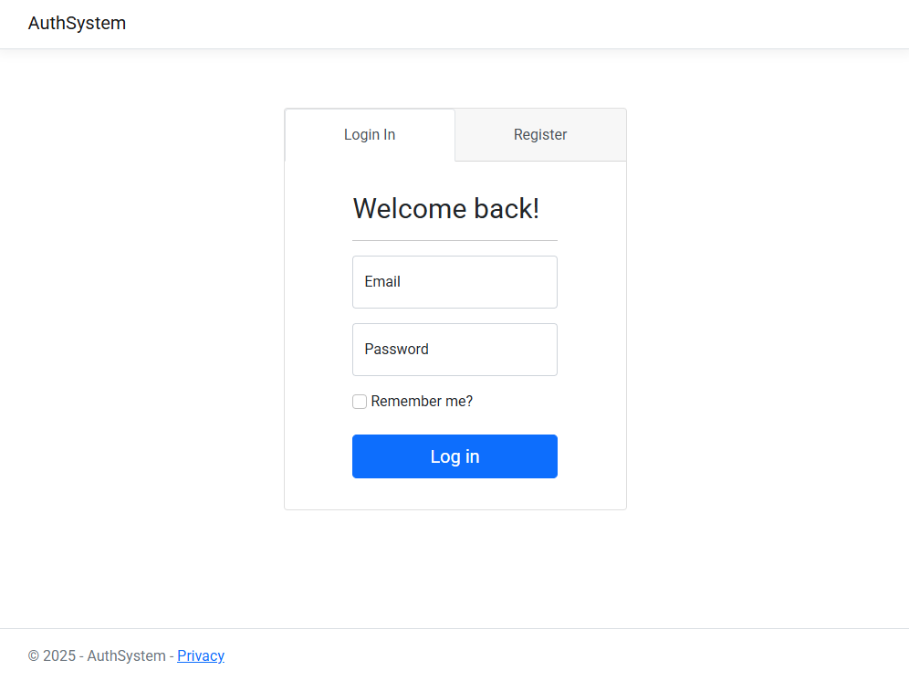
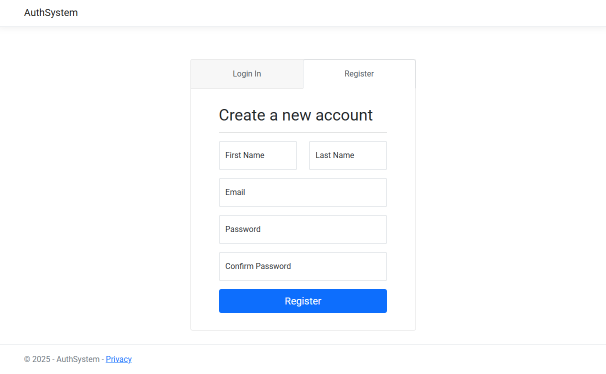
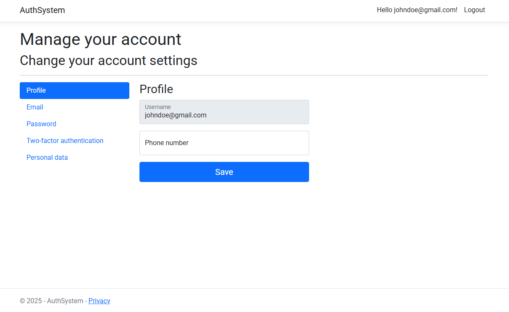

# ASP.NET Core MVC Project using Core Identity

## Objective
The objective of this ASP.NET Core Model View Controller (MVC) project is to implement a fully functional authentication system using ASP.NET Core Identity. It enables users to register and log in to their accounts, as well as securely manage their profile information through form-based inputs, with all user data stored securely in a connected database.

This project is based on the resources from the tutorial provided by CodAffection: [Asp.Net Core MVC & Identity UI - User Registration and Login](https://www.youtube.com/watch?v=wzaoQiS_9dI&list=PLjC4UKOOcfDQfrxjOgGKM_UmydQig8pq5&index=3)

## Skills Learned

- Controller: Learned how to manage routing, handle user requests, and control the flow of data between views and the application, using HomeController.cs.  

- View: Gained experience creating a consistent UI structure using _Layout.cshtml, and implementing page-specific views such as Login.cshtml and Register.cshtml.  

- Model: Practiced extending the Identity user model to support custom user properties through ApplicationUser.cs, and integrating them into the authentication system.  

- Data Integration: Learned how to manage database connections and identity data using ApplicationDbContext and Entity Framework Core, with all user data stored and maintained through SQL Server Management Studio.  


## Project Setup Steps

1. **Add Scaffolded Identity Items**
   - Add account management pages for:
     - Account\Registration
     - Account\Login

2. **Install NuGet Packages**
   - Microsoft.AspNetCore.Identity.EntityFrameworkCore
   - Microsoft.AspNetCore.Identity.UI
   - Microsoft.EntityFrameworkCore.SqlServer
   - Microsoft.EntityFrameworkCore.Tools

3. **Integrate SQL Database**
   - **DbContext Class**
     - Create `AuthDbContext.cs` that inherits from `IdentityDbContext<ApplicationUser>`:
       ```csharp
       public class AuthDbContext : IdentityDbContext<ApplicationUser>
       {
           public AuthDbContext(DbContextOptions<AuthDbContext> options)
               : base(options)
           {
           }
       }
       ```
   - **Program.cs**
     - Configure the database context and Identity services:
       ```csharp
       builder.Services.AddDbContext<AuthDbContext>(options =>
           options.UseSqlServer(connectionString));

       builder.Services.AddDefaultIdentity<ApplicationUser>(options => 
           options.SignIn.RequireConfirmedAccount = false)
           .AddEntityFrameworkStores<AuthDbContext>();
       ```
   - **appsettings.json**
     - Configure the connection string:
       ```json
       "ConnectionStrings": {
         "DefaultConnection": "Server=localhost;Database=AuthSystem;Trusted_Connection=True;MultipleActiveResultSets=true;"
       }
       ```

## Images of Account Management User Interface

#### Account Login



#### Account Registration



#### Account Management


